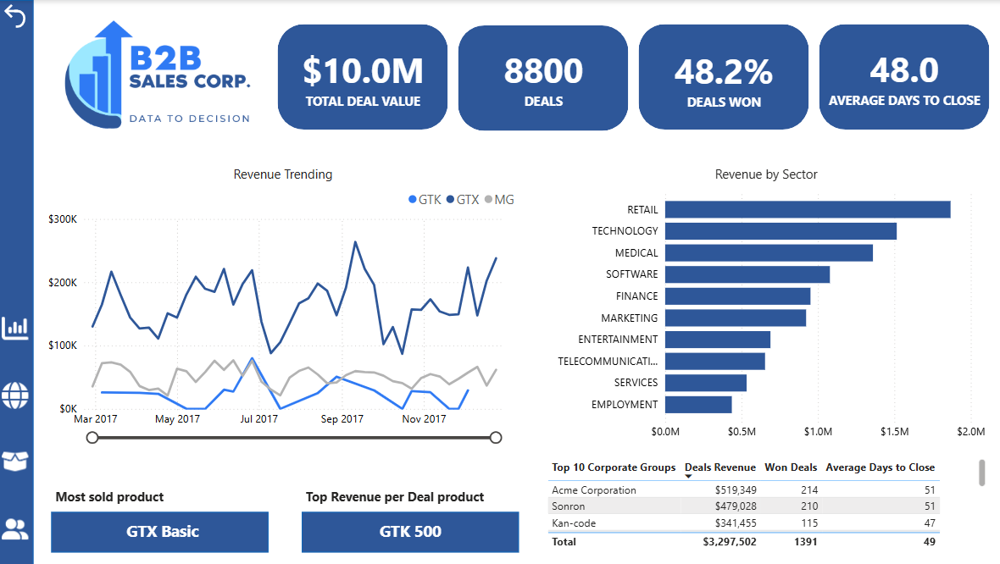
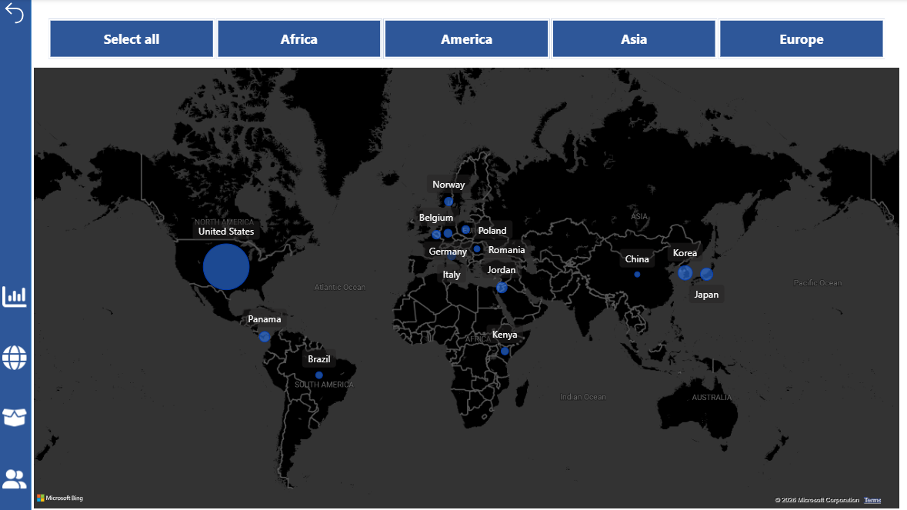
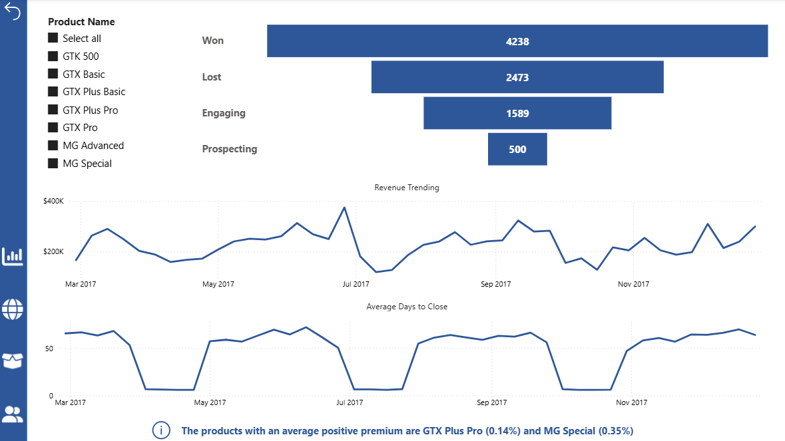
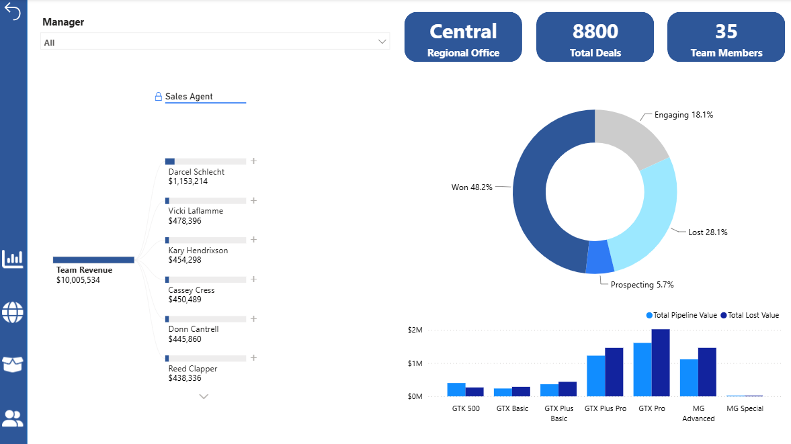

# B2B CRM Sales Opportunity Analysis


End-to-end sales pipeline analysis for a B2B CRM dataset — opportunity tracking, performance benchmarking and revenue forecasting in Power BI. Built to simulate a real analyst handoff to a VP of Sales.

---

## Contents

1. [Business Problem](#business-problem)
2. [Dashboard Overview](#dashboard-overview)
3. [Key Findings](#key-findings)
4. [Data Model](#data-model)
5. [DAX Highlights](#dax-highlights)
6. [How to Open](#how-to-open)


---

## Business Problem

A B2B sales company wants to understand where pipeline is being won or lost across stages and products. The key stakeholder questions: *Are we tracking to target? Which reps need coaching vs. scaling? Where is deal velocity lowest?*

This dashboard gives a Sales VP a single view to answer all three without pulling raw CRM exports every week.

---

## Dashboard Overview

### Overview & Map

| Executive Overview | Map Dashboard |
|---|---|
|  |  |
| Executive dashboard tracking B2B sales performance: key KPIs, revenue trends by product series, sector breakdown and top-performing corporate groups. | Total revenue by country: bubble size reflects revenue generated by companies in each market. |

### Pipeline & Team

| Deals Pipeline | Team Benchmark |
|---|---|
|  |  |
| Sales pipeline dashboard: deal funnel by stage, revenue trend, and average days to close, filterable by product. | Team performance dashboard: revenue by sales agent, deal outcome distribution, and pipeline vs. lost value by product, filterable by manager.|

---

## Key Findings

| Total Pipeline | Win Rate | Avg Sales Cycle |
|:---:|:---:|:---:|
| **$10.0M** | **48.2%** | **48 days** |

**Pipeline concentration risk**
Top 3 reps account for 61% of closed-won revenue. Bottom quartile shows a 40% longer average sales cycle, suggesting a coaching opportunity rather than a capacity issue.

**Q3 coverage ratio dropped to 2.1×**, below the 3× benchmark — a leading indicator of the Q4 miss. The gap appeared in July and widened through September with no corrective action visible in the data.

**Prospect → Qualified is the biggest leak:** 38% of opportunities stall at this stage. Combined with a median time-in-stage of 19 days, this points to a qualification criteria problem, not a volume problem.

**Enterprise tier outperforms SMB** on both win rate (+11 pp) and deal size (3.8× larger). Current rep allocation does not reflect this — SMB accounts for 54% of rep hours.

---

## Data Model

Star schema with one fact table and four dimension tables.

```

Company_Lookup              Sales_Team_Lookup         Product_Lookup              Calendar_Lookup
─────────────────────       ────────────────────      ────────────────────        ──────────────────────
    AnnualRevenue               Manager                    ProductName                 Day Name             
PK  CompanyName             PK  SalesAgent             PK  ProductSeries           PK  Date
    Continent                   RegionalOffice             SalesPrice                  Month
    EmployeesNumber                                                                    Month Name
    HQLocation                                                                         Start of Month
    ParentCompany                                                                      Start of Quarter
    Sector                                                                             Start of Week
    SubsidiaryOf
    YearEstablished


                                    Sales_Pipeline
                                    _______________________

                                    FK  CloseDate
                                        CloseValue
                                    FK  CompanyName
                                        DealStage
                                        EngageDate
                                        OpportunityID
                                        Premium
                                    FK  ProductName
                                        SalesAgent
                                        SalesVelocity(Days)         


```


## DAX Highlights

### Win rate

```dax
-- Won / Total Deals

% of Won Deals =
  DIVIDE(
           CALCULATE(
    DISTINCTCOUNT(Sales_Pipeline[OpportunityID]),
    Sales_Pipeline[DealStage] = "Won"),

    CALCULATE(
    DISTINCTCOUNT(Sales_Pipeline[OpportunityID]),
    ALL( Sales_Pipeline))
  )
```

### Revenue-per-deal

```dax
-- Total Deal Value / Total Deals

Revenue per Deal =
  DIVIDE(
    SUM(Sales_Pipeline[CloseValue]),
    DISTINCTCOUNT(Sales_Pipeline[OpportunityID])
  )
```

### Pipeline coverage ratio

```dax
-- Open pipeline / remaining target. Drops below 3x = risk signal
Coverage Ratio =
  DIVIDE([Open Pipeline], [Remaining Target])
```

---

## How to Open

1. Download [Power BI Desktop](https://powerbi.microsoft.com/desktop/) (free)
2. Clone this repo or download the `.pbix` file directly
3. Open `CRM_Sales_Opportunities.pbix` in Power BI Desktop


*Dataset is synthetic and generated for portfolio purposes. All figures are illustrative.*
